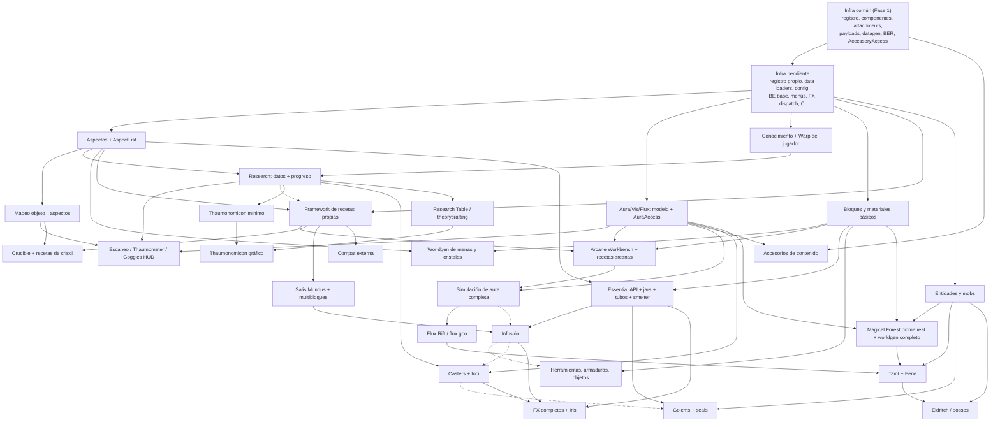

# Roadmap de implementación de Thaumcraft Reborn

> Estado: propuesta para revisión. No contiene código ni inicia la Fase 2.
> Base: auditoría 1.12.2 (`architecture.md`, `systems.md`, `dependencies.md`, `assets.md`, `porting-risks.md`), arquitectura objetivo (`fabric-26.3-architecture.md`, en particular §3, §6, §8, §10 y §11) y el skeleton de la Fase 1 (`phase-1-skeleton.md`, ya en `master`).
> Este documento **no** repite esas auditorías: se centra en las **dependencias entre sistemas** y en el orden que resulta de ellas. Las referencias `§x` apuntan a `fabric-26.3-architecture.md`; `Dn`, `Mn` y `Rn` son sus decisiones, Mixins y riesgos.

> Las decisiones cerradas están en `architecture-decisions.md` (AD-xx) y prevalecen sobre cualquier `requiere decisión` de este documento.

Etiquetas:

| Etiqueta | Significado |
|---|---|
| **requiere decisión** | No se puede determinar con la información disponible; el proyecto tiene que elegir antes de la etapa indicada. |
| **mínimo/mock** | Versión reducida que se implementa antes para desbloquear otros sistemas, sin pretender cerrar su funcionalidad. |
| **requiere verificación** | Igual que en la arquitectura: depende de una API de 26.3 que aún no se ha comprobado. |

## 1. Principios del orden de implementación

1. **Dependencia antes que facilidad.** Un sistema va antes que otro si el segundo lee sus tipos, sus datos o su API, aunque el primero sea más difícil. «Fácil» no adelanta nada.
2. **Tipos compartidos primero, comportamiento después.** Lo que se serializa (componentes, attachments, codecs, formatos de datos, ids de registro) se fija pronto, porque cambiarlo después obliga a migrar datos y rehacer contenido. El comportamiento que lo usa (simulación, efectos, UI) se puede ampliar sin romper nada.
3. **Fachada + mínimo/mock para desbloquear.** Cuando un sistema caro es consumido por otros (aura, research), primero se publica su API con una implementación mínima, y la implementación completa llega cuando ya hay consumidores reales que la ejerciten.
4. **Cada etapa termina con algo comprobable por sí solo**: gametests de servidor, gametests de cliente o comandos de debug, sin depender de etapas posteriores.
5. **Lo que más puede bloquear el proyecto va tarde y aislado.** Sistemas muy grandes y con poca reutilización (golems, taint, theorycrafting completo, FX de shaders) se retrasan hasta que todo lo que consumen sea estable, para que su complejidad no frene el resto.
6. **Gameplay reconocible lo antes posible**, pero sólo sobre fundaciones estables (§1 principio 2 de la arquitectura: datos antes que código).
7. **No se adelantan dependencias externas no decididas.** TerraBlender/Biolith (D6), visor de recetas (D9) y Mod Menu/Cloth no entran en una etapa hasta que su decisión esté tomada; los consumidores internos dependen de fachadas (`BiomePlacementAccess`, `AccessoryAccess`) y no de la librería.

## 2. Dependencias

### 2.1 Grafo de dependencias

Una flecha `A --> B` significa «B necesita A». Las líneas discontinuas son dependencias que se pueden cubrir con un **mínimo/mock**.

### 2.2 Tabla por sistema

Columnas: **Necesita** (dependencias duras), **Lo necesitan** (consumidores), **Infra Fase 1** (lo que ya existe en `master`), **Infra adicional**, **Dificultad** (B/M/A/MA = baja/media/alta/muy alta), **Riesgo arq.** (probabilidad de que cambie su diseño y obligue a refactorizar a otros), **Aislable** (se puede implementar y probar solo), **Momento**.

| Sistema | Necesita | Lo necesitan | Infra Fase 1 | Infra adicional | Dif. | Riesgo arq. | Aislable | Momento |
|---|---|---|---|---|---|---|---|---|
| API/base común | — | Todo | `ThaumcraftRebornApi.id`, capas, entrypoints, datagen, gametests | Registro propio (D3), cargadores de datos recargables (D4), config (D13), CI | M | **Alto** si se retrasa | Sí | Temprano (Etapa A) |
| Networking | Infra | Aura HUD, research, FX, casters, golems, GUIs | `CustomPacketPayload` + `StreamCodec`, registro por dirección | Patrón de validación serverbound (R13); FX dispatch S→C | B | Bajo | Sí | Temprano (A) |
| Data Components / attachments | Infra | Aspectos, aura, research, foci, golems | `probe_stamp`, `probe_interactions` (patrón validado) | Attachment de **chunk** (no probado aún), política de sync parcial | B | Medio | Sí | Temprano (A/B) |
| BlockEntities (framework) | Infra | Todas las máquinas | `TestRenderBlockEntity` sin estado persistente | Base de BE con estado vía codec (D5), sync de BE, ticker, inventarios | M | **Alto** (lo heredan ~48 BEs) | Sí | Temprano (A) |
| GUIs/Menús (framework) | BE base, networking | Arcane Workbench, research table, smelter, golems, foci | — | `MenuType`/`ExtendedMenuType`, screen base, slots propios | M | Medio | Sí (con un menú de prueba) | Temprano (A) |
| Partículas / FX (infra) | Networking | Crafting, essentia, infusión, casters, aura | — | `ParticleType`s propios mínimos + payload de FX + política §7.3 | M | Medio | Sí | Temprano (A, mínimo) |
| Rendering (infra) | Infra cliente | BERs de máquinas, entidades, HUD | BER moderno (render state + `SubmitNodeCollector`) | HUD (`HudElementRegistry`), color handlers por aspecto | M | Medio | Sí | A (base); FX completos al final |
| Accesorios | Infra | Goggles/amuletos/anillos, descuento de vis, warp ward | `AccessoryAccess` + adaptador Trinkets | Slots definitivos (D7), atributo o componente de descuento (D11) | B | Bajo (fachada) | Sí | Contenido en etapa intermedia |
| Aspectos | Registro propio, codecs | Research, scan, crucible, essentia, infusión, recetas, cristales, golems, compat | Patrón Codec/StreamCodec | Registro propio de 37 aspectos, `AspectList`, componente `aspects` | M | **Muy alto** (lo usan casi todos) | Sí | **Primero del dominio** (B) |
| Mapeo objeto→aspectos | Aspectos, data loaders, tags | Scan, crucible, derivación, compat | Datagen | Loader recargable + sync al cliente; provider de datagen | M | Alto (formato de datos) | Sí | B (explícito, sin derivación: AD-04) |
| Aura / Vis (modelo) | Attachments de chunk | Arcane crafting, casters, scan/HUD, accesorios de vis, vis generator, worldgen | Attachments | Attachment de chunk + `AuraAccess` + init por bioma (D18) | M | **Alto** (API consumida por todos) | Sí | B (**mínimo/mock**: sin difusión) |
| Aura / Flux (simulación completa) | Modelo de aura, consumidores reales | Flux Rift, taint, equilibrio de juego | — | Presupuesto por tick, round-robin, perfilado (R4), política de chunks no cargados | A | Medio (aislada tras `AuraAccess`) | Sí | Intermedio (D) |
| Nodos de aura | — | — | — | — | — | — | — | **No se implementan**: no existen en TC6 (§3). |
| Conocimiento / Warp | Attachments | Research, recetas, casters, warp events | Attachment con `copyOnDeath` + sync `targetOnly` | Modelo `PlayerKnowledge` (research+stage, puntos por categoría, flags), `PlayerWarp` | M | Alto (formato persistente) | Sí | B |
| Research (datos + lógica) | Aspectos, conocimiento, data loaders | Recetas (gating), scan, Thaumonomicon, Salis Mundus | — | Esquema/codec, conversión de los ~136 JSON, comandos | A | Alto (D4) | Sí (comandos) | B (datos) / C (progreso) |
| Escaneo / Thaumometer / goggles | Aspectos+mapeo, research, aura | Progresión inicial (OBSERVATION) | HUD no existe | Raycast de scan, payload, HUD de aura/aspectos | M | Bajo | Sí | C |
| Thaumonomicon mínimo | Research | Jugabilidad del primer milestone | — | `Screen` de cliente con lista de entradas y páginas de texto/receta simples | M | Bajo | Sí | C/D |
| Thaumonomicon gráfico | Research estable, todas las recetas | Polish | — | Mapa hex, zoom/pan, páginas animadas (R12) | A | Bajo | Sí | **Final** |
| Research Table / theorycrafting | Research, conocimiento, menús, BE | Puntos THEORY (gating de research) | — | 52 clases de cartas/aids en el original | A | Medio | Sí | D (simplificada, AD-07) / H (completa) |
| Bloques y materiales básicos | Infra, datagen | Recetas, máquinas, worldgen, herramientas | Patrón de bloque/ítem + datagen | Tabla de ids 1.12.2→26.3 (D1), texturas (D1) | B–M | Medio (ids) | Sí | C |
| Worldgen de menas/cristales | Materiales, aspectos (cristales) | Progresión de supervivencia | — | Features 26.3, `BiomeModifications` en biomas vanilla | M | Medio (formato features R10) | Sí | C |
| Recetas (framework) | Aspectos, research (gating) | Arcane, crucible, infusión, multibloques, compat | — | `RecipeType` + `RecipeSerializer(MapCodec, StreamCodec)`, sync (`recipe.v1.sync`, requiere verificación) | M | Alto (formato de datos) | Sí | C |
| Arcane Workbench + recetas arcanas | Recetas, aura, menús, materiales, cristales | Casi toda la progresión | — | Menú, drenaje de vis, cristales | M | Medio | Sí | D |
| Crucible + recetas de crisol | Recetas, mapeo de aspectos, BE con fluido | Alquimia, Thaumatorium | — | BE con agua/calor, render de líquido | M | Medio | Sí | D |
| Salis Mundus + multibloques | Recetas/datos, research | Thaumonomicon, crucible, infusión, infernal furnace, golem press | — | Tipo de datos `multiblock_transform`, `UseBlockCallback` (M6 evitado) | M | Medio | Sí | D |
| Essentia | Aspectos, BE base, `BlockApiLookup` | Infusión, Thaumatorium, golems, lámparas | — | API `EssentiaTransport`, grafo de tubos cacheado, D8 | A | Alto (API pública) | Sí | Intermedio (E) |
| Infusión | Essentia, multibloques, research, aura (flux) | Herramientas avanzadas, foci, encantamientos de infusión, artifice | — | Estabilidad, pedestales, D14 | A | Medio | Parcial | Intermedio (E) |
| Máquinas (artifice/devices) | BE base, essentia, aura | Contenido intermedio y avanzado | — | Una por máquina; varias requieren essentia o vis | M–A | Bajo (individualmente) | Sí | Intermedio, por lotes (E/F) |
| Herramientas y objetos | Materiales, componentes; algunas infusión | Gameplay general | Componentes | Tools/armaduras como componentes 26.3, infusion enchantments (D14) | M | Bajo | Sí | C (básicas) / E (infundidas) |
| Accesorios de contenido | `AccessoryAccess`, aura (vis) | Casters (descuento), warp | Fachada | D7, D11 | B–M | Bajo | Sí | E |
| Wands/Staves → Casters + foci | Aura, research, componentes; algunos foci requieren infusión | Golems (algunas interacciones), PvE | Componentes, payloads | Grafo de foci serializado, entidades proyectil, Focal Manipulator, teclas | A | Medio | Sí | Avanzado (F) |
| Flux Rift / flux goo | Simulación de aura, entidades | Taint | — | Entidad propia, fluido | M | Medio | Sí | E |
| Entidades / mobs | Infra de entidades, renderers, loot | Worldgen completo, taint, golems, eldritch | — | `FabricEntityType`, atributos, `LayerDefinition`, goals | A (43 entidades) | Bajo (individualmente) | Sí | Por lotes desde E; la mayoría en F |
| Magical Forest + worldgen completo | Materiales/árboles, entidades (spawns), aura (base por bioma), D6 | Taint (Eerie), aura base | — | Librería de biomas tras `BiomePlacementAccess`, features 26.3, estructuras como plantillas | A | Alto (D6, R9) | Sí | F (ver §3, desviación respecto a §11) |
| Taint | Flux Rift, entidades, biomas (M2), límites de servidor | Eldritch, fin de juego | — | Propagación por random ticks, M2 (requiere verificación) | A | Alto (M2) | Parcial | **Final** |
| Golems + seals | Essentia, entidades, menús, muchas partes; FakePlayer | Logística de fin de juego | — | Navegación propia, seals, task manager, render compuesto | MA | Medio | Parcial | **Final** |
| Eldritch / bosses | Taint, entidades, warp | Fin de juego | — | Bosses, estructuras | A | Bajo | Parcial | **Final** |
| Rendering/FX completos | Contenido que los emite | Polish | BER moderno | Partículas avanzadas, streams, post-efectos con alternativa HUD (D15–D17), matriz Iris | A | Medio | Sí | **Final** (pero con política fijada en A) |
| Compatibilidad externa | APIs estables | — | Trinkets ya integrado | Visor de recetas (D9), Mod Menu/Cloth, detección Iris | B–M | Bajo | Sí | **Final** |

### 2.3 Sistemas raíz

Del grafo salen cinco sistemas de los que depende casi todo y que, por tanto, fijan el orden:

1. **Infra pendiente** (registro propio, cargadores de datos, BE base, menús, FX dispatch).
2. **Aspectos** (`AspectList` y su mapeo): lo leen research, recetas, crucible, essentia, infusión, cristales, scan, golems y compat.
3. **Aura (API + modelo)**: la consumen el crafting arcano, los casters, los accesorios de vis, el scan/HUD y el worldgen.
4. **Conocimiento + research (datos)**: condiciona recetas, scan, casters y el Thaumonomicon.
5. **Framework de recetas propias**: base de arcane, crucible, infusión y multibloques.

## 3. Etapas propuestas

Resumen (las letras no son la Fase 2; la numeración de fases la decidirá el proyecto):

| Etapa | Nombre | Equivale aprox. a §11 | Resultado |
|---|---|---|---|
| **A** | Cierre de infraestructura | Fases 0–1 (lo que falta) | Toda la plomería genérica, probada con contenido de debug. |
| **B** | Modelo de dominio | Fase 2 (sin bioma) | Aspectos, aura (mínima), conocimiento y research como datos. Comandos de debug. |
| **C** | Contenido base y descubrimiento | Parte de fases 3–5 | Materiales, menas/cristales, scan, goggles, Thaumonomicon mínimo, framework de recetas. |
| **D** | **Primer gameplay** | Fases 3 y 5 | Arcane Workbench, Crucible, Salis Mundus, aura completa con flux. **Milestone jugable** (§6). |
| **E** | Sistemas intermedios | Fases 6–7 | Essentia, infusión, accesorios de contenido, Flux Rift, primeras máquinas e infusiones. |
| **F** | Sistemas avanzados y mundo | Fases 8 y 10 | Casters/foci, Magical Forest y worldgen completo, entidades. |
| **G** | Fin de juego | Fases 9 y 11 | Golems/seals, taint, warp events, eldritch. |
| **H** | Polish y compatibilidad | Fases 12–13 | Thaumonomicon gráfico, theorycrafting completo, FX/Iris, compat. |

**Desviaciones respecto a §11 de la arquitectura** (aprobadas; AD-05, AD-06):

- **Magical Forest se inserta en la etapa F, no en la Fase 2.** §11 lo adelantaba para no cambiar la distribución de biomas de mundos ya generados y porque el aura base depende del bioma. Ninguno de los dos motivos obliga a hacerlo pronto: durante el desarrollo los mundos de prueba son desechables, y el aura base se puede calcular con **tags de bioma** propios (`thaumcraft_reborn:aura/...`) en los que Magical Forest entrará cuando exista, sin refactor. Retrasarlo evita atar las etapas B–E a una librería en beta (R9). **Sí** se mantiene pronto la decisión D6 y la fachada `BiomePlacementAccess` (sin implementación). La inserción debe estar hecha **antes de la primera versión pública**, que es cuando la distribución pasa a importar.
- **El aura se divide en dos**: modelo + API + simulación mínima en B, simulación completa en D (§11 la ponía entera en la fase 3, antes de research).
- **El Thaumonomicon mínimo sube a C/D**, porque el primer milestone jugable necesita una forma de leer la progresión dentro del juego (§11 lo dejaba sólo en modo debug hasta la fase 12).
- **CI** se adelanta a la etapa A: §11 la daba por hecha en la fase 0, pero el repo todavía no tiene CI.

## 4. Detalle por etapa

### Etapa A — Cierre de infraestructura

- **Objetivo:** completar la plomería genérica que la Fase 1 no cubrió, para que ningún sistema de dominio tenga que inventarla sobre la marcha.
- **Sistemas incluidos:**
  - CI (build + gametests + datagen sin diffs). El blueprint de entorno ya instala Java 25; falta el workflow del repo.
  - Helper de **registro propio** (AD-03) probado con un registro de debug.
  - **Cargador de datos recargable** genérico (`SyncedDataLoader`, AD-03) con sync al cliente, probado con datos de debug.
  - **Config** propia JSON + Codec (AD-08), con sync de valores de gameplay.
  - **BlockEntity base** con estado vía `ValueInput`/`ValueOutput`, ticker y sync (AD-09), y un BE de debug con inventario.
  - **Menú base** (`ExtendedMenuType` + screen) con un menú de debug.
  - **FX dispatch mínimo:** `ParticleType` propio + payload S→C para emitir efectos desde el servidor, con la política §7.3 aplicada.
  - **Attachment de chunk** de debug (el patrón todavía no se ha probado; lo necesita el aura).
  - **Tabla de ids 1.12.2 → 26.3** en `docs/id-mapping.md` (AD-10).
- **Dependencias satisfechas:** sólo la Fase 1.
- **Qué debe poder probarse:** gametests de cada pieza (registro propio sincronizado, datos recargados con `/reload`, BE que conserva estado tras guardar y cargar, menú que abre y sincroniza, attachment de chunk persistente, partícula emitida desde el servidor en un client gametest). CI verde.
- **Riesgos:** D3, D4 y D5 tienen APIs de 26.3 sin verificar; si alguna no se comporta como se espera, es mejor descubrirlo aquí que con 48 BEs escritos. Riesgo de sobreingeniería: cada pieza debe tener un solo consumidor de debug, no un framework especulativo.

### Etapa B — Modelo de dominio

- **Objetivo:** fijar los tipos que todo Thaumcraft lee y escribe.
- **Sistemas incluidos:**
  - **Aspectos:** registro de los 37 aspectos (6 primales + 31 compuestos), `AspectList` (Codec + StreamCodec), componente `aspects`, colores para tinte.
  - **Mapeo objeto→aspectos** explícito por datos (ids, tags `c:`), con provider de datagen. Sin derivación desde recetas (AD-04).
  - **Aura (mínimo/mock):** attachment de chunk `{base, vis, flux}`, `AuraAccess` (`drainVis`, `addFlux`, `getVis`, `getFlux`, `getBase`), inicialización de `base` por tags de bioma (D18) y una simulación mínima (sólo regeneración hacia `base`). Sin difusión, sin fase lunar, sin rifts.
  - **Conocimiento y warp:** attachments `PlayerKnowledge` y `PlayerWarp` con sync `targetOnly`.
  - **Research (datos):** esquema con codec, cargador (D4), conversión de los JSON 1.12.2 a formato nuevo (al menos las categorías BASICS y ALCHEMY), comandos `research grant/revoke/list`.
  - **Fachada `BiomePlacementAccess`** sin implementación (AD-06); la elección TerraBlender/Biolith (D6) se cierra antes de F.
- **Dependencias satisfechas:** registro propio, data loaders, attachments de chunk y config (A).
- **Qué debe poder probarse:** comandos de debug que muestran los aspectos del ítem en la mano y el aura del chunk; gametests de roundtrip de `AspectList`; research concedido por comando que persiste y llega al cliente; drenaje de vis que se regenera.
- **Riesgos:** el formato de `AspectList`, de `PlayerKnowledge` y del JSON de research es lo más caro de cambiar del proyecto (riesgo arq. muy alto); conviene revisarlos antes de cerrar la etapa. La conversión de research depende de la tabla de ids (A) y de D1.

### Etapa C — Contenido base y descubrimiento

- **Objetivo:** que exista el mundo material de Thaumcraft y que el jugador pueda descubrir aspectos y aura.
- **Sistemas incluidos:**
  - **Bloques y materiales básicos:** amber, cinnabar, quicksilver, thaumium, cristales de vis por aspecto (primales primero), Arcane Stone, Greatwood/Silverwood como bloques (sin worldgen de árboles).
  - **Worldgen de menas y cristales** en biomas vanilla con `BiomeModifications` (permitido por §6.15; no sustituye a Magical Forest).
  - **Goggles of Revealing y Thaumometer**, escaneo (OBSERVATION + aspectos descubiertos) y **HUD** de aura/aspectos.
  - **Framework de recetas propias** (tipos y serializers, gating por research) y recetas vanilla de los bloques básicos por datagen.
  - **Herramientas básicas** de thaumium.
  - **Thaumonomicon mínimo:** `Screen` con lista de categorías/entradas y páginas de texto (sin mapa hex).
- **Dependencias satisfechas:** aspectos, mapeo, aura, research (B); BE, menús, HUD/FX (A).
- **Qué debe poder probarse:** mundo nuevo con menas y cristales; escanear un ítem otorga conocimiento y muestra sus aspectos; las goggles muestran vis/flux del chunk; el libro mínimo lista lo investigado; una receta de prueba con gating sólo funciona si el research está concedido.
- **Riesgos:** la importación de assets originales exige registrar su procedencia (AD-02); formatos de features de 26.3 (R10); sync de recetas (`recipe.v1.sync`, requiere verificación).

### Etapa D — Primer gameplay (milestone)

- **Objetivo:** primera progresión jugable de Thaumcraft (§6).
- **Sistemas incluidos:**
  - **Salis Mundus** y transformaciones de multibloque básicas (estantería → Thaumonomicon, mesa → Arcane Workbench, caldero → Crucible).
  - **Arcane Workbench** con recetas arcanas (vis del chunk + cristales) y flux generado al craftear.
  - **Crucible** con calor/agua, disolución de ítems a aspectos y recetas de crisol.
  - **Simulación de aura completa:** difusión, fase lunar, conversión de exceso en flux, presupuesto por tick, política de chunks no cargados, perfilado (R4).
  - Progresión **BASICS → ALCHEMY** con el Thaumonomicon mínimo y una Research Table/theorycrafting simplificada sobre las abstracciones definitivas (AD-07).
- **Dependencias satisfechas:** recetas, materiales, scan, libro mínimo (C); aura modelo (B).
- **Qué debe poder probarse:** en supervivencia, sin comandos: encontrar materiales, escanear, crear el Thaumonomicon, la Arcane Workbench y el Crucible, craftear las primeras recetas consumiendo vis y generando flux; el aura evoluciona en un servidor de prueba con métricas de coste por tick.
- **Riesgos:** equilibrio de la simulación de aura sin el hilo original; el algoritmo exacto de difusión debe extraerse del JAR; el modelo de theorycrafting (AD-07) debe quedar fijado en B para que la versión simplificada no se reescriba en H.

### Etapa E — Sistemas intermedios

- **Objetivo:** abrir la parte media del árbol de investigación (ALCHEMY avanzada, ARTIFICE, INFUSION).
- **Sistemas incluidos:**
  - **Essentia:** API `EssentiaTransport` + `BlockApiLookup`, Smelter, Alembic, Jars, tubos (valve, filter, oneway, restrict, buffer), D8.
  - **Infusión:** Infusion Matrix, pedestales, estabilidad, recetas de infusión; encantamientos de infusión según D14.
  - **Flux Rift** (entidad) y flux goo, conectados a la simulación de aura.
  - **Accesorios de contenido** (amuletos/anillos de vis, Goggles como accesorio si D7 lo decide) sobre `AccessoryAccess`; descuento de vis (D11).
  - Primer lote de **máquinas** que sólo dependen de essentia/aura (Centrifuge, lámparas, Condenser, Vis Generator…).
  - Herramientas y armaduras infundidas.
- **Dependencias satisfechas:** multibloques, recetas, aura completa (D); aspectos (B).
- **Qué debe poder probarse:** una red de essentia mueve aspectos según la succión (gametests con una red fija); una infusión completa con y sin inestabilidad; un rift aparece al superar el umbral de flux.
- **Riesgos:** rendimiento de la red de tubos (grafo cacheado); API pública de essentia difícil de cambiar después; renderers de jars/tubos (algunos no descompilados, R7).

### Etapa F — Sistemas avanzados y mundo

- **Objetivo:** completar AUROMANCY y el mundo de Thaumcraft.
- **Sistemas incluidos:**
  - **Casters y foci:** casters, grafo de foci (`medium → effect → mod`) como componente, entidades proyectil, Focal Manipulator, Focus Pouch, teclas y HUD.
  - **Magical Forest como bioma real** con la librería elegida en D6, sus features (greatwood, silverwood, vishroom, flores), superficie y atributos de entorno; árboles y plantas en el resto del Overworld; Mounds y estructuras como plantillas.
  - **Entidades y mobs** del mundo: Wisp, Pech (comercio y GUI), Brainy Zombie, Firebat, cultistas y champion modifiers.
- **Dependencias satisfechas:** aura, research, infusión (B–E); materiales y árboles (C); entidades necesitan sólo infra.
- **Qué debe poder probarse:** foci combinados con coste de vis y validación en servidor (R13); Magical Forest aparece con semilla fija (test determinista, R9); spawns y loot correctos.
- **Riesgos:** D6 y la beta de la librería (R9); editor de grafos del Focal Manipulator (UI compleja); 43 entidades con renderers nuevos.

### Etapa G — Fin de juego

- **Objetivo:** GOLEMANCY y ELDRITCH.
- **Sistemas incluidos:** golems (partes por datos, Golem Builder, navegación, render compuesto), seals y task manager, logística; taint (propagación con límites, Eerie según D6, mobs de taint, M2); warp events; bosses y contenido eldritch.
- **Dependencias satisfechas:** essentia, entidades, casters, biomas, flux rift.
- **Qué debe poder probarse:** golems básicos (fill/empty/harvest/guard) en gametests; taint con límites configurables que no destruye un servidor de prueba (R5).
- **Riesgos:** golems son el sistema propio más grande (FakePlayer, pathfinding); M2 (mutación de biomas en runtime) sin verificar.

### Etapa H — Polish y compatibilidad

- **Objetivo:** cerrar la experiencia y la compatibilidad.
- **Sistemas incluidos:** Thaumonomicon gráfico completo (mapa hex, páginas de receta animadas), Research Table con theorycrafting completo (si en D se usó una versión simplificada), FX completos (streams, rayos, post-efectos con alternativa HUD, D15–D17), matriz Iris/Sodium/OIT, visor de recetas (D9), Mod Menu/Cloth, detección de Iris, API pública documentada.
- **Dependencias satisfechas:** todo el contenido y los datos de research estables.
- **Qué debe poder probarse:** matriz de shaders verificada; recetas visibles en el visor elegido.
- **Riesgos:** R3 (rendering en drops futuros), R14 (visores cambiantes).

## 5. Sistemas para dejar al final

| Sistema | Por qué se retrasa |
|---|---|
| Golems + seals | Depende de essentia, entidades, menús, casters y FakePlayers; es el sistema propio más grande y casi nadie depende de él. Adelantarlo sólo multiplica los refactors. |
| Taint + Eerie | Necesita Flux Rifts, biomas reales y mutación de biomas en runtime (M2, sin verificar); puede dañar mundos (R5). Es contenido de fin de juego. |
| Eldritch / bosses | Depende de taint, warp y entidades; mínima reutilización. |
| Thaumonomicon gráfico | Mucho trabajo de UI sobre datos que cambiarán hasta que todo el contenido exista (R12). Se cubre antes con la versión mínima. |
| Theorycrafting completo | 52 clases en el original y sólo produce puntos THEORY; se puede sustituir temporalmente (§6.2). |
| FX avanzados y post-efectos | Dependen del contenido que los emite y de D15–D17; la **política** de rendering se fija en A para no escribir renderers que luego haya que tirar. |
| Compatibilidad externa | Requiere APIs estables; las dependencias (D9) no están decididas. |
| Magical Forest (inserción) | Ver §3: se retrasa a F por dependencia de una librería beta; no se retrasa su decisión ni su fachada. |

## 6. Primer milestone de gameplay

### 6.1 Propuesta: «Aprendiz de taumaturgo» (final de la etapa D)

Es el primer punto en el que Thaumcraft Reborn deja de ser infraestructura. En un mundo de supervivencia nuevo, sin comandos, un jugador puede:

1. Encontrar menas de cinnabar/amber y cristales de vis generados en el Overworld.
2. Usar la Salis Mundus sobre una estantería para obtener el Thaumonomicon (mínimo) y ver las entradas de BASICS.
3. Escanear ítems, bloques y criaturas con el Thaumometer para descubrir aspectos y ganar conocimiento.
4. Ver con las Goggles la vis y el flux del chunk.
5. Transformar una mesa en la Arcane Workbench y craftear recetas arcanas que consumen vis del chunk y cristales, generando flux.
6. Transformar un caldero en el Crucible y disolver ítems para crear las primeras recetas alquímicas.
7. Observar cómo la vis se regenera (con fase lunar) y el flux se acumula si abusa del crafting.

Por qué este milestone:

- Ejercita **todos los sistemas raíz** (§2.3) con consumidores reales, de modo que sus formatos quedan validados antes de construir encima essentia, infusión, casters y golems.
- Es la apertura reconocible de TC6 (BASICS → ALCHEMY).
- No depende de ninguna dependencia externa sin decidir (ni librería de biomas, ni visor de recetas).
- Es probable de forma automática: gametests para recetas, aura y research; client gametest para HUD y libro.

Lo que **no** incluye: essentia, infusión, casters, Magical Forest, mobs, golems, taint ni el libro gráfico.

### 6.2 THEORY en el milestone (decidido, AD-07)

En TC6 avanzar en research exige puntos **THEORY** (theorycrafting en la Research Table) además de OBSERVATION (escaneo). El milestone incluye una Research Table **simplificada**: un subconjunto de cartas sobre las mismas abstracciones y datos que el sistema completo de la etapa H. No hay fuentes temporales de THEORY.

## 7. Decisiones arquitectónicas

Las decisiones que esta sección dejaba abiertas están cerradas en `architecture-decisions.md`: assets e ids (AD-02, AD-10), registries y datos recargables (AD-03), aspectos sin derivación (AD-04), aura (AD-05), Magical Forest (AD-06), THEORY (AD-07), config (AD-08) y persistencia de BlockEntities (AD-09).

Siguen abiertas: la elección TerraBlender/Biolith (D6, antes de F), los nombres de slots de Trinkets (D7, antes de E), el visor de recetas (D9, en H) y la licencia de redistribución de assets (R1, antes de publicar).
